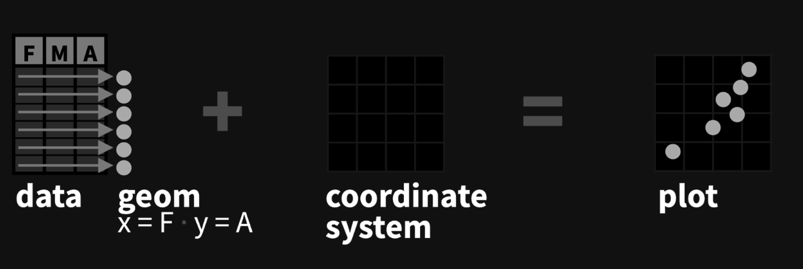

```{r, include = F}
# This is the recommended set up for flipbooks
# you might think about setting cache to TRUE as you gain practice --- building flipbooks from scratch can be time consuming
knitr::opts_chunk$set(fig.width = 6, message = FALSE, warning = FALSE, comment = "", cache = F)
library(flipbookr)
library(tidyverse)
library(lubridate)
```

<!-- ## Video 3 -->
<!-- - ggplot2 -->


---

```{r, echo=F, fig.retina=TRUE, out.width=600}
knitr::include_graphics("images/ggplot2_exploratory.png")
```
---
class: inverse, center, middle

### ggplot2 is based on the **grammar of graphics**, the idea that you can build every graph from the same components: a **data** set, a **coordinate system**, and **geoms**—visual marks that represent data points

```{r, echo=F, fig.retina=TRUE, out.width=700}

```

---
class: inverse, center, middle

### To display values, map variables in the data to visual properties of the geom (aesthetics) like size, color, and x and y locations.


```{r, echo=F, fig.retina=TRUE, out.width=700}
knitr::include_graphics("images/coords2.png")
```


---
class: inverse, center, middle

### You only need two lines of code, really. 

### The rest is just extra customization.


```{r, echo=F, fig.retina=TRUE, out.width=700}

```


---

```{r bobsog}

burgers <- data.frame(employee=c("Bob", "Gene",
                              "Linda", "Louise",
                              "Tina"),
                   time=c(25, 30, 60, 20, 50),
                   age=c(42, 11, 39, 9, 13),
                   interest=c("cooking", "music", "wine", "chaos", "horses"))

burgers

burgers <- burgers %>% 
  mutate(where="front")

burgers
```

---
`r chunk_reveal("bobs",  widths = c(2,1))`

```{r bobs, warning=F, message=F, include=F, fig.height=3}
burgers

ggplot(burgers, aes(x=where, y=time, fill=employee)) + 
  geom_col(position="stack") 
```


---
`r chunk_reveal("bobs2",  widths = c(2,1))`

```{r bobs2, warning=F, message=F, include=F, fig.height=3}
burgers

ggplot(burgers, aes(x=employee, y=time, fill=employee)) + 
  geom_col(position="stack")
```

---
class: inverse, center, middle

### Layers

```{r, echo=F, fig.retina=TRUE, out.width=600}

```

---
class: inverse, center, middle


### Aesthetics

```{r, echo=F, fig.retina=TRUE, out.width=600}
knitr::include_graphics("images/ggplot2a.png")
```


---
`r chunk_reveal("bobs3", break_type = "rotate",widths = c(2,1))`

```{r bobs3, warning=F, message=F, include=F}
  ggplot(burgers) + 
    geom_point(aes(x=employee, y=time)) #ROTATE 
    geom_point(aes(x=employee, y=time, fill=employee)) #ROTATE 
    geom_point(aes(x=employee, y=time, fill=employee, color=employee)) #ROTATE 
    geom_point(aes(x=employee, y=time, fill=employee, color=employee, size=age)) #ROTATE 
```

---
class: inverse, center, middle

### geoms

Many more [geom types](https://twitter.com/search?q=geom_%20%23rstats&src=typed_query&f=image) for different visualizations. 

```{r, echo=F, fig.retina=TRUE, out.width=600}
knitr::include_graphics("images/ggplot3a.png")
```


---
`r chunk_reveal("bobs4", break_type = "rotate",widths = c(2,1))`

```{r bobs4, warning=F, message=F, include=F}
  ggplot(burgers) + 
    geom_col(aes(x=employee, y=time), stat="identity") #ROTATE 
    geom_col(aes(x=time, y=employee), stat="identity") #ROTATE 

```

---

```{r disney}
disney <- read_csv("data/disney_movies_total_gross.csv")

glimpse(disney)
```

---

```{r disney2}
disney <- read_csv("data/disney_movies_total_gross.csv")

glimpse(disney)
```

```{r adjust}
disney <- disney %>% 
  mutate(release_date=mdy(release_date),
         total_gross=parse_number(total_gross),
         inflation_adjusted_gross=parse_number(inflation_adjusted_gross)) 

glimpse(disney)
```
---


---
`r chunk_reveal("disney3",  widths = c(1,1))`

```{r disney3, warning=F, message=F, include=F}
disney %>% 
  ggplot(aes(x=release_date, 
             y=inflation_adjusted_gross,
             color=genre)) +
  geom_point() 
```


---
class: inverse, center, middle

### layers

```{r, echo=F, fig.retina=TRUE, out.width=600}
knitr::include_graphics("images/ggplot4a.png")
```

---
`r chunk_reveal("disney4", widths = c(1,1))`

```{r disney4, warning=F, message=F, include=F}
disney %>% 
  ggplot(aes(x=release_date, 
             y=inflation_adjusted_gross, 
             color=genre)) +
  geom_point() +
  scale_x_date(limits=c(ymd("1980-01-01"), ymd("2020-01-01")))
```

---
`r chunk_reveal("disney5", widths = c(1,1))`

```{r disney5, warning=F, message=F, include=F}
disney %>% 
  ggplot(aes(x=release_date, 
             y=inflation_adjusted_gross, 
             color=genre)) +
  geom_point() +
  scale_x_date(limits=c(ymd("1980-01-01"), 
                              ymd("2020-01-01"))) +
  scale_y_continuous(limits=c(0, 1000000000)) 

```

---
`r chunk_reveal("disney6", widths = c(1,1))`

```{r disney6, warning=F, message=F, include=F}
disney %>% 
  ggplot(aes(x=release_date, 
             y=inflation_adjusted_gross, 
             color=genre)) +
  geom_point() +
  scale_x_date(limits=c(ymd("1980-01-01"), 
                              ymd("2020-01-01")),
                     labels=scales::date_format("%Y")) +
  scale_y_continuous(limits=c(0, 1000000000),
                     labels=scales::dollar_format()) 

```


---
class: inverse, center, middle

### facets

(also known as small multiples)

---
`r chunk_reveal("disney7", widths = c(1,1))`

```{r disney7, warning=F, message=F, include=F}
disney %>% 
  ggplot(aes(x=release_date, 
             y=inflation_adjusted_gross)) +
  geom_point() +
  scale_x_date(limits=c(ymd("1980-01-01"), 
                              ymd("2020-01-01")),
                     labels=scales::date_format("%Y")) +
  scale_y_continuous(limits=c(0, 1000000000),
                     labels=scales::dollar_format()) +
  facet_wrap(~genre)

```


---
class: inverse, center, middle

### labels


---
`r chunk_reveal("disney7a", widths = c(1,1))`

```{r disney7a, warning=F, message=F, include=F}
disney %>% 
  ggplot(aes(x=release_date, 
             y=inflation_adjusted_gross)) +
  geom_point() +
  scale_x_date(limits=c(ymd("1980-01-01"), 
                              ymd("2020-01-01")),
                     labels=scales::date_format("%Y")) +
  scale_y_continuous(limits=c(0, 1000000000),
                     labels=scales::dollar_format()) +
  facet_wrap(~genre) +
  labs(title="Disney animated movie gross profit") +
  labs(subtitle="Adjusted for inflation") +
  labs(y="", x="") +
  labs(caption="Data: Source Goes Here")

```


---
class: inverse, center, middle

### themes


---
`r chunk_reveal("disney8", widths = c(1,1))`

```{r disney8, warning=F, message=F, include=F}
disney %>% 
  ggplot(aes(x=release_date, 
             y=inflation_adjusted_gross)) +
  geom_point() +
  scale_x_date(limits=c(ymd("1980-01-01"), 
                              ymd("2020-01-01")),
                     labels=scales::date_format("%Y")) +
  scale_y_continuous(limits=c(0, 1000000000),
                     labels=scales::dollar_format()) +
  facet_wrap(~genre) +
  labs(title="Disney animated movie gross profit") +
  labs(subtitle="Adjusted for inflation") +
  labs(y="", x="") +
  labs(caption="Data: Source Goes Here") +
  theme(strip.background = element_rect(colour = "black", fill = "white")) +
  theme(legend.key = element_rect(fill = "white", colour = "black")) +
  theme_minimal()
```
---


```{r, echo=F, fig.retina=TRUE, out.width=600}
knitr::include_graphics("images/ggplot2_masterpiece.png")
```
